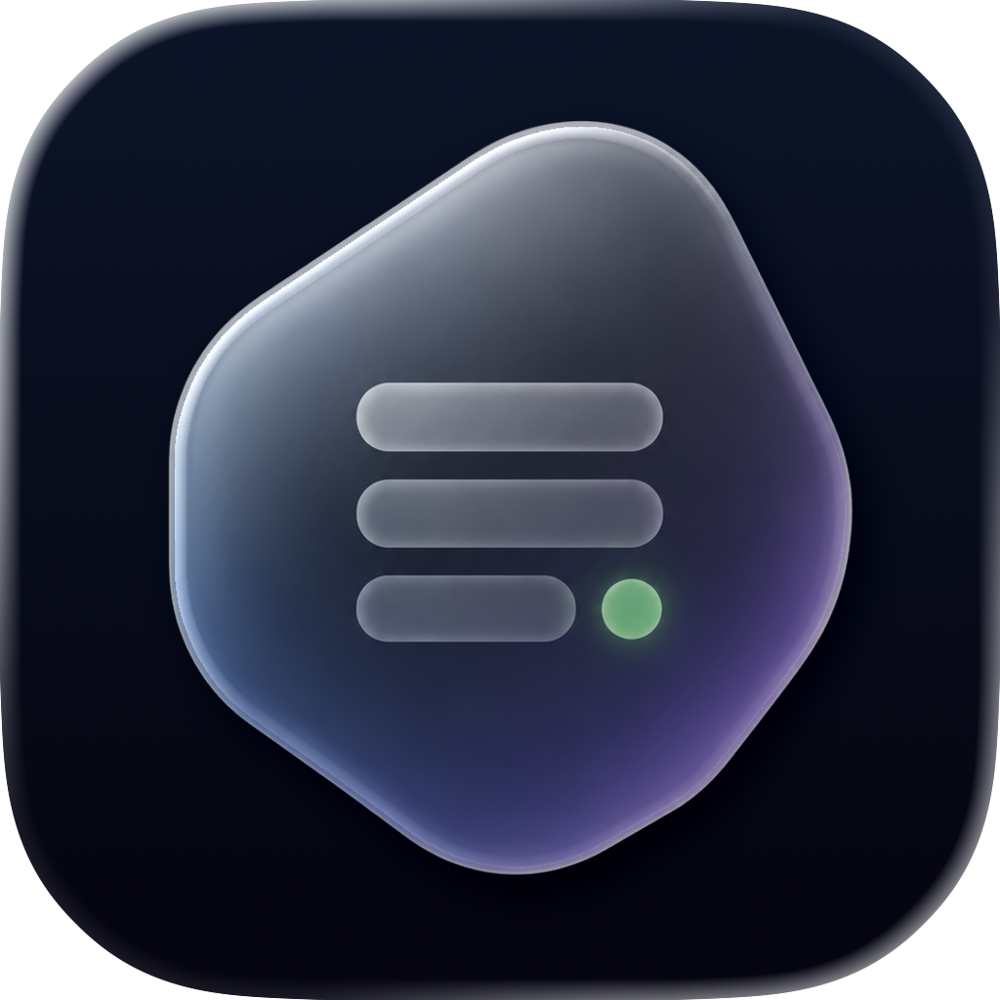

<p align="center">
  
</p>

<div align="center">

# MicaGo

[English](README.md) · [简体中文](README.zh-Hans.md) · **繁體中文**

**你的 iMessage、你的 Mac、你的手機 —— 中間什麼都沒有。**
*一個自架的 iMessage 橋接工具。沒有 MicaGo 雲端、沒有帳號、沒有中繼。*

[文件](docs/index.zh-Hant.md) · [快速上手](docs/getting-started.zh-Hant.md) · [安全模型](#-安全模型) · [遠端存取](docs/remote-access-cloudflare.md) · [CHANGELOG](MicaGoServer/docs/CHANGELOG.md)

</div>

---

## 概覽

MicaGo 讓你 **自己的** Android 手機,透過你 **自己的** Mac,收發你的 iMessage。Mac 上的
一個小巧 Go 伺服器讀取本機「訊息」資料庫,提供一套私密、受權杖保護的 API;一個 macOS
選單列 **Companion(伴隨程式)** 負責執行並管理它;一個 **Flutter Android 應用程式** 透過
你的 Wi‑Fi(或你自行掌控的選用公開網址)與之配對。你的資料始終只在 **你的** Mac 和
**你的** 裝置之間傳輸。

> ⚠️ **專案狀態:** 可用、可自架,但仍相當年輕。它讀取 macOS「訊息」的內部機制,並需要
> 「完全取用磁碟」權限。在依賴它之前,請先閱讀 [安全模型](#-安全模型) 與
> [限制](#-限制)。與 Apple 無任何關聯。

---

## ✨ 你能得到什麼

- 🔐 **自架。** 沒有 MicaGo 帳號或代管中繼。選用的推播與遠端存取使用 **你** 自己擁有並
  設定的服務。
- 💬 **對話與訊息。** 對話列表、訊息串、點按回應(Tapback)、引用回覆、傳送特效、貼圖、
  **位置 / 手寫 / Digital Touch**,以及內嵌圖片/影片與全螢幕檢視器。
- 📤 **傳送。** 透過 iMessage 傳送文字與附件、**語音訊息**,以及在你開啟後傳送簡訊
  (預設關閉,由伺服器設定控制)。
- ⚡ **即時 + 補齊。** WebSocket 事件用於即時更新,再加上以游標為基礎的 **增量(delta)**
  同步,在程式關閉後補上遺漏 —— 不會漏訊息。
- 🌐 **區域網路優先。** 會公告多條區域網路路由;用戶端自動選擇可達的一條並允許你釘選。
  選用的公開網址(你自己的通道)可在任何地方存取。
- 👤 **聯絡人比對。** 在本機做姓名比對,需選擇啟用 —— 通訊錄絕不上傳。
- 🔔 **通知(選用)。** 一個背景保活服務就能發出原生 Android MessagingStyle 通知,什麼都
  不用設定。想用推播,改接你 **自己的** Firebase 也行。

---

## 🧩 運作原理

```
            ┌──────────────────────── 你的 Mac ────────────────────────┐
            │                                                            │
 訊息       │   chat.db ──► 同步迴圈 ──► relay.db ──► REST + WebSocket   │
 (iMessage) │      ▲                                        │           │
            │      │ AppleScript / 選用的 IMCore 輔助程式    │           │
            │   ┌──┴───────────────┐                         │           │
            │   │  Mac Companion   │  執行並管理伺服器                   │
            │   │  （選單列程式）  │                         │           │
            │   └──────────────────┘                         │           │
            └────────────────────────────────────────────────┼──────────┘
                                                              │
                       區域網路（同一 Wi‑Fi）  ──或──  選用公開網址（你的通道）
                                                              │
                                                   ┌──────────▼──────────┐
                                                   │     Android 用戶端  │
                                                   │   （Flutter 程式）  │
                                                   └─────────────────────┘
```

- **讀取路徑** —— 伺服器將 `chat.db` 單向同步進自己的 `relay.db`,再提供一套小而穩定的
  REST + WebSocket API。用戶端透過以游標為基礎的 **增量** 補齊,並透過 socket 取得即時事件。
- **傳送路徑** —— 文字透過 AppleScript 經由「訊息」傳送;附件透過 multipart 上傳。編輯 /
  收回 / 刪除 使用選用的內建 [IMCore 輔助程式](#-選用功能)。
- **配對** —— Companion 顯示包含區域網路/公開候選位址與一個 bearer 權杖的 QR code / 連線
  JSON;用戶端掃描或貼上它。

---

## 🔐 安全模型

MicaGo 是 **本機優先** 的,設計上讓你的資料始終屬於你。

| 關注點 | MicaGo 如何處理 |
| --- | --- |
| **驗證** | 每個 API 呼叫都需要伺服器產生的 **bearer 權杖**(`~/.micago/config.yaml`)。任何同時擁有你的網址 **和** 權杖的人都能存取你的 Mac —— 請像密碼一樣對待它。 |
| **網路** | 預設繫結到你的 **區域網路**。公開暴露需你主動開啟,且由你負責;任何離開你網路的流量都應優先用 HTTPS。 |
| **你的資料** | **沒有 MicaGo 雲端中繼。** 聯絡人在本機比對,絕不上傳。 |
| **推播** | 若你啟用 FCM,負載只攜帶很小的喚醒/預覽 —— 絕不包含你的訊息歷史或權杖。 |
| **私有 API** | 選用的 IMCore 輔助程式(編輯/收回/刪除)受能力偵測限制;絕不偽造成功。 |

> **MicaGo 做的** —— 把 *你的* iMessage 橋接到 *你的* 裝置,走 *你* 掌控的連線。
> **MicaGo **不** 做的** —— 執行雲端、持有帳號、把你的訊息存到你 Mac 以外的任何地方,或上傳你的通訊錄。

---

## 🚀 快速開始

最簡單的方式是執行 **Companion**,它會為你建置並啟動內建的伺服器:

1. 在 Xcode 中開啟 `MicaGoServer/micago-mac-companion/MicaGoCompanion.xcodeproj` 並執行
   (或建置 release 版本再啟動)。
2. 在提示時授予 **完全取用磁碟** 權限,然後 **啟動** 伺服器。它預設繫結 `0.0.0.0:3000`
   (區域網路可達)。
3. 在 Companion 的 **建立連線** 卡片上,顯示 QR code(或複製連線 JSON)。
4. 在 Android 程式中,**掃描 QR code** 或 **貼上連線 JSON** 進行配對 —— 它會自動透過區域
   網路連線。

偏好命令列?參見 [分元件建置](#-分元件建置)。

---

## 🛠 分元件建置

**伺服器**(`MicaGoServer/micago-server`)

```sh
cd MicaGoServer/micago-server
go build ./cmd/micago        # 產生 ./micago
./micago --version
go test ./...
go run ./cmd/micago          # 首次執行會產生 ~/.micago/config.yaml 和一個權杖
```

**Companion**(`MicaGoServer/micago-mac-companion`)

```sh
cd MicaGoServer/micago-mac-companion
xcodebuild -project MicaGoCompanion.xcodeproj -scheme MicaGoCompanion -configuration Debug build
```

> Xcode 建置階段會把內建的 `micago` 後端 **以及** `micago-imcore-helper` 編譯進程式的
> `Resources/`。

**用戶端**(`MicaGoFlutterClient`)

```sh
cd MicaGoFlutterClient
flutter pub get
flutter analyze
flutter test
flutter build apk --debug      # 或：flutter run
```

---

## 🧰 選用功能

全部選用且 **預設關閉** —— 沒有它們 MicaGo 也能完整運作。

- 🔋 **保活服務(Android)。** 最簡單、多數人會用的方式:一個前景服務把連線保持開啟,來訊息時
  彈出本機通知 —— 不需要推播帳號,也不需要 `google-services.json`。預設關閉;廠商電池策略
  仍可能限制它。
- 🔔 **Firebase / FCM 推播。** 不想一直掛著服務?那就接上你 **自己的** Firebase 專案走背景
  推播(什麼都不內建)。負載只是一個喚醒訊號,訊息本身透過 WebSocket 或增量同步抵達。參見
  [`docs/setup/firebase/`](docs/setup/firebase/README.md)。
- ✍️ **編輯 / 收回 / 刪除(IMCore 輔助程式)。** 一個小巧的內建輔助程式,呼叫 macOS 私有 IMCore API。
  - *用途* —— 從手機端編輯/收回/刪除一則已傳的 iMessage。
  - *它 **不** 做* —— 偽造成功。如果你的 Mac 不授予 IMCore 存取,它會回報 *不支援*,這些操作就隱藏。
- 🌍 **遠端存取。** 在伺服器前自行架設反向代理 / 通道(例如 Cloudflare Tunnel),並在
  Companion 中設定 **公開網址**。MicaGo 不提供也不管理通道。參見
  [`docs/remote-access-cloudflare.md`](docs/remote-access-cloudflare.md)。

---

## 🗂 儲存庫結構

```
MicaGo/
├── MicaGoServer/
│   ├── micago-server/          # Go 中繼伺服器（`micago` 執行檔）
│   ├── micago-mac-companion/   # macOS SwiftUI 選單列 Companion
│   └── docs/                   # 軟體/設計文件 + CHANGELOG
├── MicaGoFlutterClient/        # Flutter Android 用戶端
├── docs/                       # 使用者指南（快速上手、遠端存取……）
└── README.md
```

> `Ref/`（若本機存在）存放開發期間使用的第三方參考專案。它 **不屬於** MicaGo,且已被
> git 忽略。

---

## 🌐 在地化

Android 用戶端內建 **English / 简体中文 / 繁體中文**(在設定中選擇,或跟隨系統語言)。
Companion 的選單/側邊欄與這些文件也已在地化;本 README 提供 [简体中文](README.zh-Hans.md)
與 [繁體中文](README.zh-Hant.md) 版本。

---

## ⚠️ 限制

- **繫結 macOS。** 伺服器必須執行在已登入 iMessage 且已授予完全取用磁碟權限的 Mac 上。它
  讀取即時的「訊息」資料庫。
- **編輯/收回/刪除** 取決於你的 Mac 是否授予私有 API(IMCore)存取;不可用之處會隱藏這些操作。
- **程式被終止後的通知** 靠保活服務;你願意用 Firebase 的話,也可以靠你自己的
  `google-services.json`。兩者都沒有時,通知只能盡力而為,重新開啟後由 socket 加增量同步把
  訊息補齊。
- **只在 Android 上驗證過。** Flutter 用戶端理論上也能建置到其他平台,只是目前只測試過
  Android。API 在設計上與用戶端無關。
- 與 Apple 無任何關聯,亦未獲其背書。使用風險自負。

---

## 🤝 參與貢獻

歡迎提交 issue 與 pull request。提交 PR 前:

- **伺服器:** `go build ./... && go vet ./... && go test ./...`
- **用戶端:** `flutter analyze && flutter test`
- **Companion:** 在 Xcode 中建置 `MicaGoCompanion` scheme。

盡量保持改動輕量、少依賴;切勿記錄或提交 bearer 權杖或推播權杖。

---

## 🙏 致謝

MicaGo 從兩個開源專案身上學到很多 —— 它們各自啃下了 iMessage 裡同樣難處理的部分。我們研究
了它們的思路,再用自己的程式碼重新實作,沒有照搬任何原始碼。

- **[BlueBubbles](https://github.com/BlueBubblesApp)** —— 一個成熟的 iMessage 橋接工具。
  貼圖、連結預覽、位置、手寫以及 Digital Touch 的處理,是我們分類、算繪這些訊息類型時的參考。
- **[imsg](https://imsg.sh)**(作者 Peter Steinberger)—— 一個終端 iMessage 工具,它對
  `chat.db` 以及附件 / StickerCache 目錄結構的清晰讀取,指引了我們伺服器的讀取路徑。

兩者都是獨立專案,與 MicaGo 無任何關聯。
